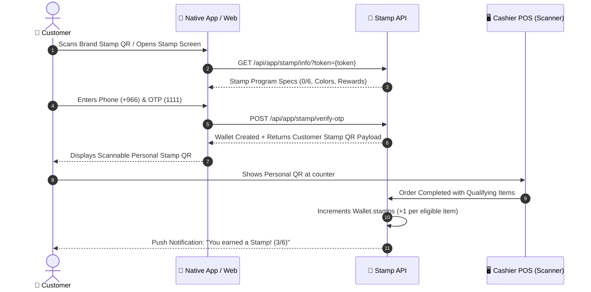

# ⭐ Digital Stamps Loyalty Program: Native App Integration Guide

This guide is for **Mobile / React Native Developers** integrating the **Digital Stamp Cards, Brand QR Join, Personal Customer QR, and Stamp Earning Flows** in the Servi App.

---

## 📑 Table of Contents
1. [Overview & Sequence Diagram](#1-overview--sequence-diagram)
2. [Brand Stamp QR vs Customer Personal Stamp QR](#2-brand-stamp-qr-vs-customer-personal-stamp-qr)
3. [Digital Stamps API Specifications](#3-digital-stamps-api-specifications)
   - [3.1 Resolve Brand Stamp Program (`GET /api/app/stamp/info`)](#31-resolve-brand-stamp-program)
   - [3.2 Phone Lookup & OTP (`POST /api/app/stamp/check-phone`)](#32-phone-lookup--otp)
   - [3.3 Verify OTP & Provision Wallet (`POST /api/app/stamp/verify-otp`)](#33-verify-otp--provision-wallet)
   - [3.4 Get Customer Wallets & Stamp Cards (`GET /api/customer/wallets`)](#34-get-customer-wallets--stamp-cards)
4. [How Customers Earn Stamps (POS & Order Logic)](#4-how-customers-earn-stamps)
5. [Database Schemas](#5-database-schemas)
6. [Source Code & Controllers Reference](#6-source-code--controllers-reference)

---

## 1. Overview & Sequence Diagram



---

## 2. Brand Stamp QR vs Customer Personal Stamp QR

| QR Type | Flow & Usage | Payload / Data Structure |
| :--- | :--- | :--- |
| **Brand Stamp Join QR** | Printed on counter / display / packaging. Scanned by customer phone camera. | `https://servi.sa/stamp?token=<ENCRYPTED_BRAND_STAMP_TOKEN>` |
| **Customer Personal Stamp QR** | Generated inside customer's app / web profile. Scanned by Cashier scanner. | `{"customerId": "USER_ID", "phone": "+966...", "tenantId": "BRAND_ID", "type": "STAMP"}` |

---

## 3. Digital Stamps API Specifications

### 3.1 Resolve Brand Stamp Program
When a customer scans a brand's printed stamp QR code or opens a brand stamp link:

- **Method**: `GET`
- **URL**: `/api/app/stamp/info?token=<TOKEN>` (or `?tenantId=<TENANT_ID>`)
- **Auth**: Public
- **Sample Response**:
```json
{
  "success": true,
  "data": {
    "brand": {
      "id": "c7e0b73c-4ba4-4c67-95d8-b03a1a84182d",
      "name": "Servi Coffee",
      "slug": "servi-coffee",
      "logoUrl": "/uploads/brands/logo.png"
    },
    "stampProgram": {
      "id": "stamp-1",
      "nameEn": "Drinks",
      "nameAr": "المشروبات",
      "requiredStamps": 6,
      "cardBgColor": "#1E297B",
      "cardTextColor": "#FFFFFF",
      "rewardTextEn": "Free Drink on 6th stamp",
      "rewardTextAr": "مشروب مجاني عند الختم السادس",
      "enabled": true
    }
  }
}
```

---

### 3.2 Phone Lookup & OTP
- **Method**: `POST`
- **URL**: `/api/app/stamp/check-phone`
- **Payload**:
```json
{
  "phone": "+966501234567"
}
```
- **Response**:
```json
{
  "success": true,
  "data": {
    "phone": "+966501234567",
    "exists": true,
    "name": "Mohammed Al-Otaibi",
    "message": "OTP sent successfully"
  }
}
```

---

### 3.3 Verify OTP & Provision Wallet
Verifies OTP code (`1111` for dev), creates user if new, ensures a wallet exists for the brand, and returns the customer's personal QR payload:

- **Method**: `POST`
- **URL**: `/api/app/stamp/verify-otp`
- **Payload**:
```json
{
  "phone": "+966501234567",
  "code": "1111",
  "name": "Mohammed Al-Otaibi",
  "tenantId": "c7e0b73c-4ba4-4c67-95d8-b03a1a84182d"
}
```
- **Response**:
```json
{
  "success": true,
  "data": {
    "token": "eyJhbGciOi...",
    "customer": {
      "id": "73d4033e-8c9a-42a4-a8ab-519f4c6cee90",
      "name": "Mohammed Al-Otaibi",
      "phone": "+966501234567"
    },
    "brand": {
      "id": "c7e0b73c-4ba4-4c67-95d8-b03a1a84182d",
      "name": "Servi Coffee"
    },
    "stampCard": {
      "stamps": 0,
      "requiredStamps": 6,
      "nameEn": "Drinks",
      "nameAr": "المشروبات",
      "cardBgColor": "#1E297B",
      "cardTextColor": "#FFFFFF",
      "rewardTextEn": "Free Drink on 6th stamp",
      "rewardTextAr": "مشروب مجاني عند الختم السادس"
    },
    "qrPayload": "{\"customerId\":\"73d4033e-8c9a-42a4-a8ab-519f4c6cee90\",\"phone\":\"+966501234567\",\"tenantId\":\"c7e0b73c-4ba4-4c67-95d8-b03a1a84182d\",\"type\":\"STAMP\"}"
  }
}
```

---

### 3.4 Get Customer Wallets & Stamp Cards
Fetches all active brand stamp cards for the logged-in customer:

- **Method**: `GET`
- **URL**: `/api/customer/wallets`
- **Headers**: `Authorization: Bearer <CUSTOMER_JWT_TOKEN>`
- **Response**:
```json
{
  "success": true,
  "data": [
    {
      "walletId": "wallet-uuid-1",
      "tenantId": "c7e0b73c-4ba4-4c67-95d8-b03a1a84182d",
      "brandName": "Servi Coffee",
      "points": 350,
      "stamps": 2,
      "stampProgress": {
        "currentStamps": 2,
        "requiredStamps": 6,
        "remainingForReward": 4,
        "rewardTextEn": "Free Drink on 6th stamp",
        "rewardTextAr": "مشروب مجاني عند الختم السادس",
        "cardBgColor": "#1E297B",
        "cardTextColor": "#FFFFFF",
        "enabled": true
      }
    }
  ]
}
```

---

## 4. How Customers Earn Stamps

1. **At Cashier / In-App Order**:
   - Customer presents their personal Stamp QR at POS counter (or places an in-app order).
   - POS scans customer's QR or cashier selects customer by phone.
2. **Qualifying Items Evaluation**:
   - The brand's stamp program configuration defines `eligibleItemIds: ["item-id-1", "item-id-2"]`.
   - On order completion, each purchased qualifying item awards **+1 Stamp**.
3. **Stamp Calculation & Auto-Reward**:
   ```js
   const totalStamps = (wallet.stamps || 0) + earnedStampsCount;
   if (totalStamps >= requiredStamps) {
     // Reward threshold reached (e.g. 6/6)!
     // 1. Automatically provisions an EarnedCoupon record with the free item reward code.
     // 2. Resets stamp count:
     wallet.stamps = totalStamps % requiredStamps;
   } else {
     wallet.stamps = totalStamps;
   }
   ```

---

## 5. Database Schemas

### `Tenant.stampPrograms` (JSON column in Main Database `Tenant` table)
```json
[
  {
    "id": "stamp-prog-1",
    "nameEn": "Drinks",
    "nameAr": "المشروبات",
    "requiredStamps": 6,
    "cardBgColor": "#1E297B",
    "cardTextColor": "#FFFFFF",
    "rewardTextEn": "Free Drink on 6th stamp",
    "rewardTextAr": "مشروب مجاني عند الختم السادس",
    "eligibleItemIds": ["item-1", "item-2"],
    "enabled": true
  }
]
```

### `Wallet` (Main Database)
```prisma
model Wallet {
  id           String    @id @default(uuid())
  points       Int       @default(0)
  lifetimeEarn Int       @default(0)
  stamps       Int       @default(0)  // Active stamp count (e.g. 0 to 5)
  tier         String?   @default("bronze")
  appUserId    String
  appUser      AppUser   @relation(fields: [appUserId], references: [id], onDelete: Cascade)
  tenantId     String?
  tenant       Tenant?   @relation(fields: [tenantId], references: [id], onDelete: Cascade)
  
  @@unique([appUserId, tenantId])
}
```

### `EarnedCoupon` (Main Database)
```prisma
model EarnedCoupon {
  id          String    @id @default(uuid())
  title       String    // e.g. "Free Drink Reward"
  code        String    // e.g. "STAMP-FREE-4921"
  discount    Float     @default(100)
  isUsed      Boolean   @default(false)
  tenantId    String?
  appUserId   String
  appUser     AppUser   @relation(fields: [appUserId], references: [id], onDelete: Cascade)
}
```

---

## 6. Source Code & Controllers Reference

| Functional Area | Backend File Path | Purpose |
| :--- | :--- | :--- |
| **Stamp Services & Endpoints** | `src/app/stamp/stamp.service.js` | Resolves stamp info, OTP verification, wallet creation. |
| **Stamp Controller** | `src/app/stamp/stamp.controller.js` | Public API endpoints for stamp QR flow. |
| **Customer Wallets Controller** | `src/app/wallet/wallet.controller.js` | Returns multi-tenant stamp cards (`/api/customer/wallets`). |
| **Stamp Earning Logic** | `src/web/tenant/loyalty/loyalty.service.js` | Calculates stamp increments on order completion. |
| **QR Encryption** | `src/utils/qrToken.utils.js` | AES-256-CBC token encryption/decryption for stamp tokens. |
