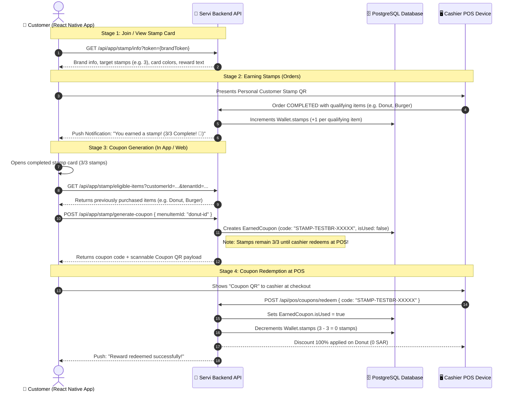

# ⭐ Digital Stamps Loyalty Program: React Native & Backend Integration Guide

Comprehensive architecture, API specifications, database schemas, and React Native implementation guide for the **Servi Digital Stamp Program**.

---

## 📑 Table of Contents
1. [Program Architecture & End-to-End Flow](#1-program-architecture--end-to-end-flow)
2. [Sequence Diagram](#2-sequence-diagram)
3. [QR Code Types in Servi](#3-qr-code-types-in-servi)
4. [API Specifications](#4-api-specifications)
   - [4.1 Resolve Brand Stamp Program (`GET /api/app/stamp/info`)](#41-resolve-brand-stamp-program)
   - [4.2 Phone Lookup & OTP (`POST /api/app/stamp/check-phone`)](#42-phone-lookup--otp)
   - [4.3 Verify OTP & Provision Wallet (`POST /api/app/stamp/verify-otp`)](#43-verify-otp--provision-wallet)
   - [4.4 Update Customer Name (`POST /api/app/stamp/update-name`)](#44-update-customer-name)
   - [4.5 Get Eligible Purchased Reward Items (`GET /api/app/stamp/eligible-items`)](#45-get-eligible-purchased-reward-items)
   - [4.6 Generate Free Reward Coupon (`POST /api/app/stamp/generate-coupon`)](#46-generate-free-reward-coupon)
   - [4.7 Customer Multi-Brand Wallets & Stamp Cards (`GET /api/customer/wallets`)](#47-customer-multi-brand-wallets--stamp-cards)
5. [Stamp Earning & POS Redemption Lifecycle](#5-stamp-earning--pos-redemption-lifecycle)
6. [Database Schemas (Prisma)](#6-database-schemas-prisma)
7. [React Native Implementation Guidelines](#7-react-native-implementation-guidelines)
8. [Source Code Reference](#8-source-code-reference)

---

## 1. Program Architecture & End-to-End Flow

The **Servi Digital Stamp Program** allows food & beverage brands to reward frequent customers with digital punch cards (e.g. *Buy 3 drinks, get the 4th free*).

### The 4 Core Stages:
```
┌─────────────────┐       ┌─────────────────┐       ┌─────────────────┐       ┌─────────────────┐
│ 1. JOIN / ENROLL│ ───►  │ 2. EARN STAMPS  │ ───►  │ 3. GEN COUPON   │ ───►  │ 4. REDEEM AT POS│
│ Customer scans  │       │ Cashier scans   │       │ When 3/3 earned,│       │ Cashier scans   │
│ Brand QR or     │       │ customer QR on  │       │ customer picks  │       │ Coupon QR. Item │
│ opens app.      │       │ completed order.│       │ item to generate│       │ is free, stamps │
│ Wallet created. │       │ Stamps: 1/3, 2/3│       │ coupon & QR.    │       │ reset to 0/3.   │
└─────────────────┘       └─────────────────┘       └─────────────────┘       └─────────────────┘
```

---

## 2. Sequence Diagram



---

## 3. QR Code Types in Servi

| QR Code | Generated Where | Scanned By | Payload / Format |
| :--- | :--- | :--- | :--- |
| **Brand Stamp Join QR** | Admin Portal / Printed on table tent / counter | Customer Camera / App | Encrypted AES-256 Token URL (`https://servi.sa/stamp?token=...`) |
| **Customer Stamp QR** | React Native App / Web Stamp Page | POS Cashier Scanner | `{"customerId":"...","phone":"+966...","tenantId":"...","type":"STAMP"}` |
| **Coupon Reward QR** | Generated upon completing 3/3 stamps | POS Cashier Scanner | `{"code":"STAMP-SERVIC-XXXXX","tenantId":"...","type":"COUPON"}` or string `"STAMP-SERVIC-XXXXX"` |

---

## 4. API Specifications

### 4.1 Resolve Brand Stamp Program
Resolves program rules, card theme color, and required stamps from an encrypted QR token or `tenantId`.

- **Method**: `GET`
- **URL**: `/api/app/stamp/info`
- **Query Params**:
  - `token`: Encrypted token string (from scanned QR) **OR**
  - `tenantId`: Brand UUID
- **Auth**: Public
- **Response**:
```json
{
  "success": true,
  "data": {
    "brand": {
      "id": "c7e0b73c-4ba4-4c67-95d8-b03a1a84182d",
      "name": "Servi Cafe",
      "slug": "servi-cafe",
      "logoUrl": "https://api.servi.sa/uploads/brands/logo.png"
    },
    "stampProgram": {
      "id": "stamp-prog-1",
      "nameEn": "Drinks & Desserts",
      "nameAr": "المشروبات والحلويات",
      "requiredStamps": 3,
      "cardBgColor": "#152329",
      "cardTextColor": "#FFFFFF",
      "rewardTextEn": "3 drinks and the 4th is free",
      "rewardTextAr": "٣ مشروبات والرابع مجاناً",
      "enabled": true
    }
  }
}
```

---

### 4.2 Phone Lookup & OTP
- **Method**: `POST`
- **URL**: `/api/app/stamp/check-phone`
- **Request Body**:
```json
{
  "phone": "+966598775463"
}
```
- **Response**:
```json
{
  "success": true,
  "data": {
    "phone": "+966598775463",
    "exists": true,
    "name": "Faris",
    "message": "OTP sent successfully"
  }
}
```

---

### 4.3 Verify OTP & Provision Wallet
Verifies OTP code (`1111` for dev), provisions customer wallet, and returns existing stamp progress, customer QR payload, and any active unredeemed coupon.

- **Method**: `POST`
- **URL**: `/api/app/stamp/verify-otp`
- **Request Body**:
```json
{
  "phone": "+966598775463",
  "code": "1111",
  "name": "Faris",
  "tenantId": "c7e0b73c-4ba4-4c67-95d8-b03a1a84182d"
}
```
- **Response**:
```json
{
  "success": true,
  "data": {
    "token": "eyJhbGciOiJIUzI1NiIsInR5cCI6IkpXVCJ9...",
    "customer": {
      "id": "66753d3f-8e7d-4ccc-b0f2-bb36a1c3330f",
      "name": "Faris",
      "phone": "+966598775463"
    },
    "brand": {
      "id": "c7e0b73c-4ba4-4c67-95d8-b03a1a84182d",
      "name": "Servi Cafe"
    },
    "stampCard": {
      "stamps": 3,
      "requiredStamps": 3,
      "nameEn": "Drinks & Desserts",
      "nameAr": "المشروبات والحلويات",
      "cardBgColor": "#152329",
      "cardTextColor": "#FFFFFF",
      "rewardTextEn": "3 drinks and the 4th is free",
      "rewardTextAr": "٣ مشروبات والرابع مجاناً"
    },
    "qrPayload": "{\"customerId\":\"66753d3f-8e7d-4ccc-b0f2-bb36a1c3330f\",\"phone\":\"+966598775463\",\"tenantId\":\"c7e0b73c-4ba4-4c67-95d8-b03a1a84182d\",\"type\":\"STAMP\"}",
    "activeCoupon": {
      "id": "0df6409d-e63c-4868-bce0-579491eecd15",
      "code": "STAMP-SERVIC-CLAIM",
      "prizeLabel": "Free Donut (Stamp Reward)",
      "itemName": "Donut",
      "expiresAt": "2026-10-30T17:35:35.476Z",
      "qrPayload": "{\"code\":\"STAMP-SERVIC-CLAIM\",\"tenantId\":\"c7e0b73c-4ba4-4c67-95d8-b03a1a84182d\",\"customerId\":\"66753d3f-8e7d-4ccc-b0f2-bb36a1c3330f\",\"type\":\"COUPON\"}"
    }
  }
}
```

### 4.4 Update Customer Name
Updates the customer's full name after OTP verification (used in 3-step onboarding flow for new users).

- **Method**: `POST`
- **URL**: `/api/app/stamp/update-name`
- **Request Body**:
```json
{
  "customerId": "66753d3f-8e7d-4ccc-b0f2-bb36a1c3330f",
  "name": "Mohammed Al-Otaibi"
}
```
- **Response**:
```json
{
  "success": true,
  "data": {
    "customer": {
      "id": "66753d3f-8e7d-4ccc-b0f2-bb36a1c3330f",
      "name": "Mohammed Al-Otaibi",
      "phone": "+966598775463"
    }
  }
}
```

---

### 4.5 Get Eligible Purchased Reward Items
Returns only the specific menu items that the customer previously ordered to earn their stamps.

- **Method**: `GET`
- **URL**: `/api/app/stamp/eligible-items?customerId=<CUSTOMER_ID>&tenantId=<TENANT_ID>`
- **Auth**: Public or Bearer Token
- **Response**:
```json
{
  "success": true,
  "data": {
    "items": [
      {
        "id": "a6a8d2d7-7c5c-4f4a-91d2-2b4f3da559f7",
        "name": "Donut",
        "description": "Fresh glazed donut",
        "price": 20,
        "imageUrl": "/uploads/menu/donut.jpg"
      },
      {
        "id": "39626ab9-2da2-4728-a367-d4abf37dc53c",
        "name": "Burger",
        "description": "Double smash beef burger",
        "price": 30,
        "imageUrl": "/uploads/menu/burger.jpg"
      }
    ],
    "rewardTextEn": "Free Stamp Reward",
    "rewardTextAr": "مكافأة الختم المجانية"
  }
}
```

---

### 4.5 Generate Free Reward Coupon
Called when the user chooses an eligible item from the list and taps **"Generate Coupon"**.
- Creates the `EarnedCoupon` record in PostgreSQL.
- Does **NOT** decrement stamps in the wallet (stamps are decremented at POS when claimed).
- Returns the coupon code and scannable QR payload.

- **Method**: `POST`
- **URL**: `/api/app/stamp/generate-coupon` (alias: `/api/app/stamp/claim-coupon`)
- **Request Body**:
```json
{
  "customerId": "66753d3f-8e7d-4ccc-b0f2-bb36a1c3330f",
  "tenantId": "c7e0b73c-4ba4-4c67-95d8-b03a1a84182d",
  "menuItemId": "a6a8d2d7-7c5c-4f4a-91d2-2b4f3da559f7"
}
```
- **Response**:
```json
{
  "success": true,
  "data": {
    "coupon": {
      "id": "0df6409d-e63c-4868-bce0-579491eecd15",
      "code": "STAMP-SERVIC-CLAIM",
      "prizeLabel": "Free Donut (Stamp Reward)",
      "itemName": "Donut",
      "menuItemId": "a6a8d2d7-7c5c-4f4a-91d2-2b4f3da559f7",
      "expiresAt": "2026-10-30T17:35:35.476Z",
      "qrPayload": "{\"code\":\"STAMP-SERVIC-CLAIM\",\"tenantId\":\"c7e0b73c-4ba4-4c67-95d8-b03a1a84182d\",\"customerId\":\"66753d3f-8e7d-4ccc-b0f2-bb36a1c3330f\",\"menuItemId\":\"a6a8d2d7-7c5c-4f4a-91d2-2b4f3da559f7\",\"type\":\"COUPON\"}"
    },
    "currentStamps": 3
  }
}
```

---

### 4.6 Customer Multi-Brand Wallets & Stamp Cards
Fetches all active brand loyalty points and stamp cards for the customer's in-app Wallet screen.

- **Method**: `GET`
- **URL**: `/api/customer/wallets`
- **Headers**: `Authorization: Bearer <CUSTOMER_JWT>`
- **Response**:
```json
{
  "success": true,
  "data": [
    {
      "walletId": "w-123",
      "tenantId": "c7e0b73c-4ba4-4c67-95d8-b03a1a84182d",
      "brandName": "Servi Cafe",
      "logoUrl": "https://api.servi.sa/uploads/brands/logo.png",
      "points": 120,
      "stamps": 3,
      "stampProgress": {
        "currentStamps": 3,
        "requiredStamps": 3,
        "remainingForReward": 0,
        "isComplete": true,
        "cardBgColor": "#152329",
        "cardTextColor": "#FFFFFF",
        "rewardTextEn": "3 drinks and the 4th is free",
        "rewardTextAr": "٣ مشروبات والرابع مجاناً"
      },
      "activeCoupon": {
        "code": "STAMP-SERVIC-CLAIM",
        "prizeLabel": "Free Donut (Stamp Reward)",
        "expiresAt": "2026-10-30T17:35:35.476Z"
      }
    }
  ]
}
```

---

## 5. Stamp Earning & POS Redemption Lifecycle

### Earning Stamps on POS Orders:
1. When a cashier completes an order at the POS (or Table QR order is completed):
   ```js
   // In loyalty.service.js / orders.service.js
   const stampProg = tenant.stampPrograms?.[0];
   if (stampProg && stampProg.enabled) {
     const eligibleItemIds = stampProg.eligibleItemIds || [];
     let earnedStamps = 0;
     
     for (const item of order.items) {
       if (eligibleItemIds.includes(item.menuItemId)) {
         earnedStamps += item.quantity || 1;
       }
     }
     
     if (earnedStamps > 0) {
       await mainPrisma.wallet.update({
         where: { id: customerWallet.id },
         data: { stamps: { increment: earnedStamps } }
       });
     }
   }
   ```

### Redeeming Coupon at POS Cashier:
1. Cashier scans the customer's **Coupon QR** (`STAMP-SERVIC-CLAIM`).
2. POS validates `EarnedCoupon` (checks `isUsed == false` and `expiresAt > now()`).
3. POS applies a 100% discount on the designated reward item.
4. On order completion:
   - Sets `EarnedCoupon.isUsed = true`.
   - Decrements `wallet.stamps`: `Math.max(0, wallet.stamps - requiredStamps)`.

---

## 6. Database Schemas (Prisma)

### Main Database (`schema.main.prisma`)
```prisma
model Wallet {
  id           String    @id @default(uuid())
  points       Int       @default(0)
  lifetimeEarn Int       @default(0)
  stamps       Int       @default(0)  // Active stamp count
  tier         String?   @default("bronze")
  appUserId    String
  appUser      AppUser   @relation(fields: [appUserId], references: [id], onDelete: Cascade)
  tenantId     String?
  tenant       Tenant?   @relation(fields: [tenantId], references: [id], onDelete: Cascade)
  createdAt    DateTime  @default(now())
  updatedAt    DateTime  @updatedAt

  @@unique([appUserId, tenantId])
  @@index([appUserId])
  @@index([tenantId])
}

model EarnedCoupon {
  id            String    @id @default(uuid())
  code          String    @unique
  prizeLabel    String    // e.g. "Free Donut (Stamp Reward)"
  prizeImageUrl String?
  tenantId      String?
  tenant        Tenant?   @relation(fields: [tenantId], references: [id], onDelete: Cascade)
  isUsed        Boolean   @default(false)
  usedAt        DateTime?
  winDate       DateTime  @default(now())
  expiresAt     DateTime  // 7-day validity
  appUserId     String
  appUser       AppUser   @relation(fields: [appUserId], references: [id], onDelete: Cascade)
  createdAt     DateTime  @default(now())
  updatedAt     DateTime  @updatedAt

  @@index([appUserId])
  @@index([tenantId])
}
```

---

## 7. React Native Implementation Guidelines

### Suggested Screen Structure:
```
📱 React Native Navigation
 ├── 🗂️ WalletScreen (Points + Multi-Brand Stamp Cards tab)
 ├── 🎫 StampCardDetailScreen
 │    ├── Brand Logo & Title
 │    ├── Digital Stamp Card (#1, #2, #3 Stamp Slots)
 │    ├── Action Button:
 │    │    ├─ If activeCoupon exists: [Show Coupon QR] (Emerald Button)
 │    │    └─ If stamps >= 3 & no coupon: [Generate Reward Coupon] (Gold Button)
 │    └── Customer Personal Stamp QR (Present to cashier to collect stamps)
 ├── 🎁 SelectRewardItemModal (Picker for Donut / Burger)
 └── 🎟️ ShowCouponQrModal (Displays STAMP-SERVIC-CLAIM + Scannable QR Code)
```

### QR Code Rendering in React Native:
Use `react-native-qrcode-svg`:
```tsx
import QRCode from 'react-native-qrcode-svg';

// 1. Personal Customer Stamp QR (scanned by cashier to give stamps)
<QRCode
  value={customerQrPayloadString}
  size={200}
  color="#0f172a"
  backgroundColor="#ffffff"
/>

// 2. Claimed Reward Coupon QR (scanned by cashier to redeem reward)
<QRCode
  value={activeCoupon.code} // or activeCoupon.qrPayload
  size={180}
  color="#0f172a"
  backgroundColor="#ffffff"
/>
```

---

## 8. Source Code Reference

| Functional Area | Backend File | Frontend Web File |
| :--- | :--- | :--- |
| **Stamp Services & OTP** | `Backend_Loyalty/src/app/stamp/stamp.service.js` | `servi_website/src/pages/customer/CustomerStampCard.tsx` |
| **Stamp Controller** | `Backend_Loyalty/src/app/stamp/stamp.controller.js` | — |
| **Stamp Routes** | `Backend_Loyalty/src/app/stamp/stamp.routes.js` | `servi_website/src/App.tsx` (`/stamp`) |
| **AES-256 Token Utilities** | `Backend_Loyalty/src/utils/qrToken.utils.js` | `servi_website/src/pages/admin/Loyalty.tsx` |
| **Customer Wallets API** | `Backend_Loyalty/src/app/wallet/wallet.controller.js` | — |
