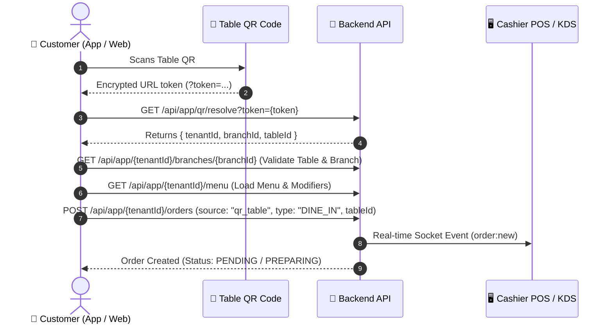

# 🍽️ Table QR Dining & In-Seat Ordering: Native App Integration Guide

This guide is for **Mobile / React Native Developers** integrating the **Table QR Dining and In-Seat Ordering** features in the Servi App.

---

## 📑 Table of Contents
1. [Overview & Sequence Diagram](#1-overview--sequence-diagram)
2. [QR Code Format & Decryption (`GET /api/app/qr/resolve`)](#2-qr-code-format--decryption)
3. [Fetching Branch & Table Status](#3-fetching-branch--table-status)
4. [Fetching Menu & Modifiers](#4-fetching-menu--modifiers)
5. [Placing Table Orders (`POST /api/app/:tenantId/orders`)](#5-placing-table-orders)
6. [Database Schemas](#6-database-schemas)
7. [Source Code & Controllers Reference](#7-source-code--controllers-reference)

---

## 1. Overview & Sequence Diagram



---

## 2. QR Code Format & Decryption

### QR Code URL
When a customer scans a table QR, the URL structure is:
```
https://servi.sa/customer/menu?token=<ENCRYPTED_AES256_TOKEN>
```

### Resolving the Token
Before fetching menu or branch data, decrypt the token to obtain the branch and table IDs:

- **Method**: `GET`
- **URL**: `/api/app/qr/resolve?token=<TOKEN_STRING>`
- **Auth**: Public (No JWT required)
- **Response**:
```json
{
  "success": true,
  "data": {
    "tenantId": "c7e0b73c-4ba4-4c67-95d8-b03a1a84182d",
    "branchId": "1a2b3c4d-5e6f-7a8b-9c0d-1e2f3a4b5c6d",
    "tableId": "table-uuid-101",
    "qrCashierId": null,
    "orderTypeId": null,
    "timestamp": 1790688102682
  }
}
```

---

## 3. Fetching Branch & Table Status

- **Method**: `GET`
- **URL**: `/api/app/:tenantId/branches/:branchId`
- **Validation Checklist for App**:
  1. `tenant.subQrTable !== false`: Ensure QR Table Dining is enabled for the brand.
  2. `branch.qrEnabled !== false`: Ensure QR ordering is enabled for this branch location.
  3. `table.isActive === true`: Verify the table is active and available.

---

## 4. Fetching Menu & Modifiers

- **Method**: `GET`
- **URL**: `/api/app/:tenantId/menu`
- **Modifiers Schema Format**:
```json
[
  {
    "id": "item-uuid-1",
    "name": "Spanish Latte",
    "nameAr": "سبانش لاتيه",
    "price": 22.00,
    "imageUrl": "/uploads/menus/spanish_latte.jpg",
    "modifiers": [
      {
        "id": "group-uuid-1",
        "name": "Milk Choice",
        "nameAr": "نوع الحليب",
        "type": "single_select", // dropdown | single_select | multi_select | radio | checkbox
        "required": true,
        "options": [
          {
            "id": "opt-1",
            "name": "Whole Milk",
            "nameAr": "حليب كامل الدسم",
            "priceModifier": 0.00
          },
          {
            "id": "opt-2",
            "name": "Oat Milk",
            "nameAr": "حليب شوفان",
            "priceModifier": 4.00
          }
        ]
      }
    ]
  }
]
```

---

## 5. Placing Table Orders

- **Authenticated Endpoint**: `POST /api/app/:tenantId/orders`
- **Public / Guest Endpoint**: `POST /api/app/:tenantId/orders/public`
- **Headers**:
  - `Authorization: Bearer <JWT_TOKEN>` (optional for public checkout)
  - `x-tenant-id: <tenantId>`
- **Payload Example**:
```json
{
  "branchId": "1a2b3c4d-5e6f-7a8b-9c0d-1e2f3a4b5c6d",
  "tableId": "table-uuid-101",
  "source": "qr_table",
  "type": "DINE_IN",
  "paymentMethod": "CASH", // "CASH" | "MADA" | "APPLE_PAY" | "CREDIT_CARD"
  "notes": "Extra hot please",
  "customerName": "Ahmed",
  "customerPhone": "+966501234567",
  "items": [
    {
      "menuItemId": "item-uuid-1",
      "quantity": 1,
      "price": 22.00,
      "selectedModifiers": [
        {
          "groupId": "group-uuid-1",
          "name": "Milk Choice",
          "nameAr": "نوع الحليب",
          "selectedOptions": [
            {
              "id": "opt-2",
              "name": "Oat Milk",
              "nameAr": "حليب شوفان",
              "priceModifier": 4.00
            }
          ]
        }
      ]
    }
  ]
}
```

---

## 6. Database Schemas

### `Table` (Tenant Database)
```prisma
model Table {
  id        String    @id @default(uuid())
  label     String    // e.g. "Table 12"
  seats     Int       @default(4)
  zone      String?   // e.g. "Outdoor", "Main Hall"
  isActive  Boolean   @default(true)
  branchId  String
  branch    Branch    @relation(fields: [branchId], references: [id], onDelete: Cascade)
  orders    Order[]
}
```

### `Order` (Tenant & Main Database)
```prisma
model Order {
  id              String       @id @default(uuid())
  orderNumber     String       // e.g. "#1042"
  source          String       @default("qr_table") // qr_table | qr_cashier | app | pos
  type            String       @default("DINE_IN")  // DINE_IN | TAKEAWAY | CAR_DELIVERY
  status          String       @default("PENDING")  // PENDING | CONFIRMED | PREPARING | READY | COMPLETED
  total           Float
  tableId         String?
  table           Table?       @relation(fields: [tableId], references: [id])
  branchId        String
  appUserId       String?
  createdAt       DateTime     @default(now())
}
```

---

## 7. Source Code & Controllers Reference

| Functional Area | Backend File Path | Purpose |
| :--- | :--- | :--- |
| **Token Resolution** | `src/app/branches/branches.controller.js` | Endpoint `GET /api/app/qr/resolve`. |
| **Order Placement** | `src/app/orders/orders.controller.js` | Handles table order submission & real-time dispatch. |
| **Order Service** | `src/app/orders/orders.service.js` | Validates `subQrTable`, calculates fees, and persists orders. |
| **QR Encryption** | `src/utils/qrToken.utils.js` | AES-256-CBC token encryption/decryption. |
