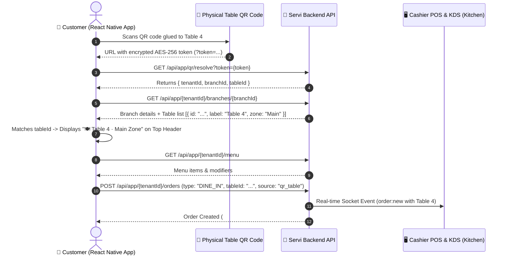

# 🍽️ Table QR Dining & In-Seat Ordering: Native App Integration Guide

This guide is for **Mobile / React Native Developers** integrating **Table QR Dining, Table Number Resolution, In-Seat Ordering, and Live Kitchen Sync** in the Servi App.

---

## 📑 Table of Contents
1. [Overview & Sequence Diagram](#1-overview--sequence-diagram)
2. [How the Native App Resolves & Displays the Table Number](#2-how-the-native-app-resolves--displays-the-table-number)
3. [QR Code Format & Decryption (`GET /api/app/qr/resolve`)](#3-qr-code-format--decryption)
4. [Fetching Branch & Table Details (`GET /api/app/:tenantId/branches/:branchId`)](#4-fetching-branch--table-details)
5. [Fetching Menu & Modifiers (`GET /api/app/:tenantId/menu`)](#5-fetching-menu--modifiers)
6. [Placing Table Orders (`POST /api/app/:tenantId/orders`)](#6-placing-table-orders)
7. [React Native UI Layout & Screen Flow for Table Dining](#7-react-native-ui-layout--screen-flow-for-table-dining)
8. [Database Schemas](#8-database-schemas)
9. [Source Code & Controllers Reference](#9-source-code--controllers-reference)

---

## 1. Overview & Sequence Diagram



---

## 2. How the Native App Resolves & Displays the Table Number

### The Step-by-Step Logic:
1. **Scan Table QR**: The customer scans the QR on their physical table (or opens a deep link `servi://menu?token=...`).
2. **Decrypt Token**: The App calls `/api/app/qr/resolve?token=<TOKEN>` to receive `{ tenantId, branchId, tableId }`.
3. **Fetch Branch Tables**: The App calls `/api/app/:tenantId/branches/:branchId` which returns an array of active `tables`:
   ```json
   "tables": [
     { "id": "table-uuid-101", "label": "Table 4", "seats": 4, "zone": "Main Dining", "isActive": true },
     { "id": "table-uuid-102", "label": "Table 5", "seats": 2, "zone": "Outdoor Terrace", "isActive": true }
   ]
   ```
4. **Find Matched Table**: The app finds the matching object:
   ```ts
   const currentTable = branch.tables.find(t => t.id === resolvedTableId);
   // currentTable.label -> "Table 4"
   // currentTable.zone  -> "Main Dining"
   ```
5. **Lock Context**: The app sets the active session mode to **`Dine-In (In-Seat Ordering)`** with `tableId` locked, preventing the user from accidentally placing a takeaway order to the wrong location.

---

## 3. QR Code Format & Decryption

### QR Code URL Structure
```text
https://servi.sa/customer/menu?token=<ENCRYPTED_AES256_TOKEN>
```

### Resolving the Token
- **Method**: `GET`
- **URL**: `/api/app/qr/resolve?token=<TOKEN_STRING>`
- **Auth**: Public (No JWT required)
- **Response**:
```json
{
  "success": true,
  "data": {
    "tenantId": "c7e0b73c-4ba4-4c67-95d8-b03a1a84182d",
    "branchId": "1a2b3c4d-5e6f-7a8b-9c0d-1e2f3a4b5c6d",
    "tableId": "table-uuid-101",
    "qrCashierId": null,
    "orderTypeId": null,
    "timestamp": 1790688102682
  }
}
```

---

## 4. Fetching Branch & Table Details

- **Method**: `GET`
- **URL**: `/api/app/:tenantId/branches/:branchId`
- **Auth**: Public
- **Response**:
```json
{
  "success": true,
  "data": {
    "id": "1a2b3c4d-5e6f-7a8b-9c0d-1e2f3a4b5c6d",
    "name": "Downtown Branch",
    "address": "King Fahd Road, Riyadh",
    "isOpen": true,
    "tablesEnabled": true,
    "qrEnabled": true,
    "tables": [
      {
        "id": "table-uuid-101",
        "label": "Table 4",
        "seats": 4,
        "zone": "Main Dining",
        "isActive": true
      },
      {
        "id": "table-uuid-102",
        "label": "Table 5",
        "seats": 2,
        "zone": "Terrace",
        "isActive": true
      }
    ],
    "tenantFeatures": {
      "subQrTable": true,
      "subQrCashier": true,
      "subPos": true,
      "subKds": true
    }
  }
}
```

---

## 5. Fetching Menu & Modifiers

- **Method**: `GET`
- **URL**: `/api/app/:tenantId/menu`
- **Modifiers Schema Format**:
```json
[
  {
    "id": "item-uuid-1",
    "name": "Spanish Latte",
    "nameAr": "سبانش لاتيه",
    "price": 22.00,
    "imageUrl": "/uploads/menus/spanish_latte.jpg",
    "modifiers": [
      {
        "id": "group-uuid-1",
        "name": "Milk Choice",
        "nameAr": "نوع الحليب",
        "type": "single_select",
        "required": true,
        "options": [
          {
            "id": "opt-1",
            "name": "Whole Milk",
            "nameAr": "حليب كامل الدسم",
            "priceModifier": 0.00
          },
          {
            "id": "opt-2",
            "name": "Oat Milk",
            "nameAr": "حليب شوفان",
            "priceModifier": 4.00
          }
        ]
      }
    ]
  }
]
```

---

## 6. Placing Table Orders

- **Authenticated Endpoint**: `POST /api/app/:tenantId/orders`
- **Public / Guest Endpoint**: `POST /api/app/:tenantId/orders/public`
- **Headers**:
  - `Authorization: Bearer <JWT_TOKEN>` (optional for guest checkout)
  - `x-tenant-id: <tenantId>`
- **Request Body**:
```json
{
  "branchId": "1a2b3c4d-5e6f-7a8b-9c0d-1e2f3a4b5c6d",
  "tableId": "table-uuid-101",
  "source": "qr_table",
  "type": "DINE_IN",
  "paymentMethod": "CASH",
  "notes": "Extra napkins please",
  "customerName": "Faris",
  "customerPhone": "+966587696323",
  "items": [
    {
      "menuItemId": "item-uuid-1",
      "quantity": 2,
      "price": 22.00,
      "selectedModifiers": [
        {
          "groupId": "group-uuid-1",
          "groupName": "Milk Choice",
          "optionId": "opt-2",
          "optionName": "Oat Milk",
          "priceModifier": 4.00
        }
      ]
    }
  ]
}
```

---

## 7. React Native UI Layout & Screen Flow for Table Dining

### 1. Menu Screen (Sticky Header)
When `tableId` is present in state:
```
┌────────────────────────────────────────────────────────┐
│  🍽️  Downtown Branch · Table 4 (Main Dining)           │
│  🟢 In-Seat Ordering Active                            │
└────────────────────────────────────────────────────────┘
```
- **Badge**: Clean black-and-white or subtle green badge showing `In-Seat Ordering`.
- **Table Label**: Prominently shows `Table 4` or `Table.label`.

### 2. Cart & Checkout Screen
```
┌────────────────────────────────────────────────────────┐
│ Order Summary                                          │
│ Order Type:   [ Dine-In (Table Service) ] 🔒 Locked    │
│ Table Number:  Table 4 (4 Seats · Main Dining)         │
│ Branch:        Downtown Branch                         │
│                                                        │
│ 2x Spanish Latte (Oat Milk)                   52.0 SAR │
│ Total (incl. VAT):                            52.0 SAR │
│                                                        │
│ [ Place Order for Table 4 ]                            │
└────────────────────────────────────────────────────────┘
```

### 3. Order Status / Tracking Screen
```
┌────────────────────────────────────────────────────────┐
│  🎉 Order Received! (#ORD-90214)                       │
│  Status: 👨‍🍳 Preparing in Kitchen                      │
│                                                        │
│  📍 Delivering to: Table 4                             │
│  Stay seated, our staff will serve your order to you!  │
└────────────────────────────────────────────────────────┘
```

### 4. Fallback: Manual Table Selection (If No QR Scanned)
If the customer browses the menu inside the app without scanning a QR code:
- Show a **"Select Table"** modal listing `branch.tables` grouped by `zone` (e.g. *Main Dining*, *Outdoor Terrace*).
- Customer taps their table number (e.g. `Table 4`) before checkout.

---

## 8. Database Schemas

### `Table` Model (`schema.tenant.prisma`)
```prisma
model Table {
  id       String  @id @default(uuid())
  label    String  // e.g. "Table 4", "VIP-1", "T-12"
  seats    Int     @default(4)
  qrCode   String? @unique
  isActive Boolean @default(true)
  zone     String? @default("Main")

  branchId String
  branch   Branch @relation(fields: [branchId], references: [id], onDelete: Cascade)

  orders   Order[]

  createdAt DateTime @default(now())
}
```

### `Order` Model (`schema.tenant.prisma`)
```prisma
model Order {
  id          String      @id @default(uuid())
  orderNumber String      @unique
  status      OrderStatus @default(PENDING) // PENDING | PREPARING | READY | COMPLETED
  type        OrderType   @default(DINE_IN) // DINE_IN | TAKEAWAY | DELIVERY
  source      String      @default("qr_table") // qr_table | pos | app

  tableId     String?
  table       Table?      @relation(fields: [tableId], references: [id])

  branchId    String
  branch      Branch      @relation(fields: [branchId], references: [id])
}
```

---

## 9. Source Code & Controllers Reference

| Functional Area | Backend File | Purpose |
| :--- | :--- | :--- |
| **QR Decryption** | `Backend_Loyalty/src/app/branches/branches.controller.js` | `GET /api/app/qr/resolve` decodes AES-256 token. |
| **Branch & Tables API** | `Backend_Loyalty/src/app/branches/branches.service.js` | Returns branch detail with active tables array. |
| **Order Placement** | `Backend_Loyalty/src/app/orders/orders.service.js` | Creates order with `tableId` & notifies POS/KDS. |
| **Web Customer Menu** | `servi_website/src/pages/customer/CustomerMenu.tsx` | Web implementation of table QR menu ordering. |
